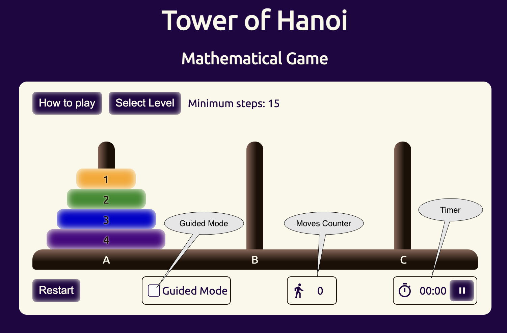
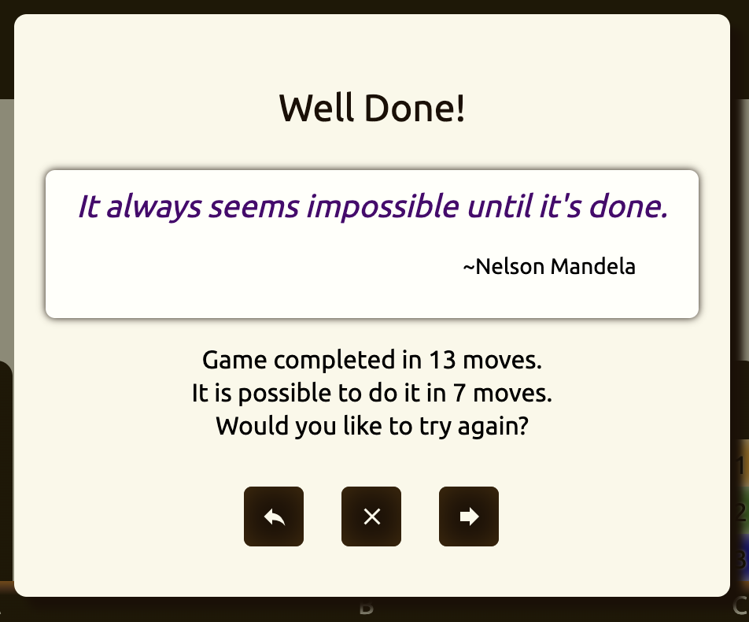

# Tower of Hanoi
In browser game developed by Elad Sadeh

## Introduction

This is my first project in GitHub! The project is part of Software Engineering Imersive bootcamp at General Assembly.

In this project, I implepented the "Tower of Hanoi" game as a browser application using HTML, css, and JavaScript.

### About the Game

Tower of Hanoi is a mathematical puzzle game that consistis of three rods and a stack of disks in different sizes. The game begin with the disks stacked on the left rod according to size, the smallest at the top.

The goal of the game is to move the whole stack to the last rod following these rules:
- Only one disk may be moved at a time.
- A disk can only be placed on top of a bigger disk.
- Only the upper disk of any stack can be moved.

The minimum number of steps to finish the game is 2^n - 1 (n is the number of disks).

## Implementation and How to play

- To start the game, simply drag the top disk of the left (A) stack and place it in either (B) or (C). Then continue moving the disks. Only the top disk in each stack is draggable and remember that disks can only be placed on top of a bigger disk (the app will enforce those rules).
- The defualt number of disks is three. To play with more disks, click on the 'Select Level' button and select the number of disks to play (click on the number).

- To see the game instructions and history, click on 'How to Play'.

- If you want to re-start the current game, click on 'Restart'

- The time will start counting when you drag the first disk. If you need to take a break, you can pause the timer and it will continue to count once you make the next move.

- The steps counter show the number of disk moves you made.

- When all the disks are at the right most rod (C), you'll see a popup window announcing your success with the option to restart the game or move to the next level. A random inspirational quote will be displayed.

### Guided Mode: 

When "Guided Mode" checkbox is checked, the app will guide the user on how to move the disks so the game will be done with the minimum number of moves.

## Installation

You are welcome to fork and clone this repository. The app consist of 3 files: index.html, app.js, and style.css. All files need to be at the root directory.

## Technologies Used

- HTML
- CSS
- JavaScript

