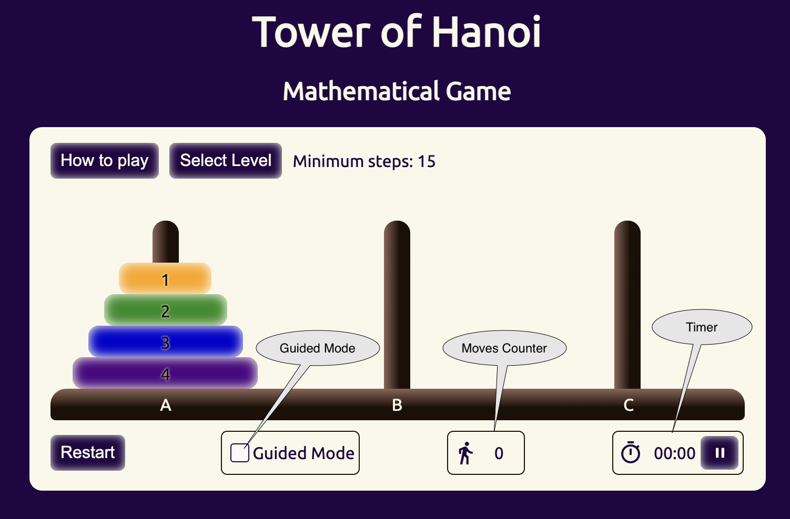
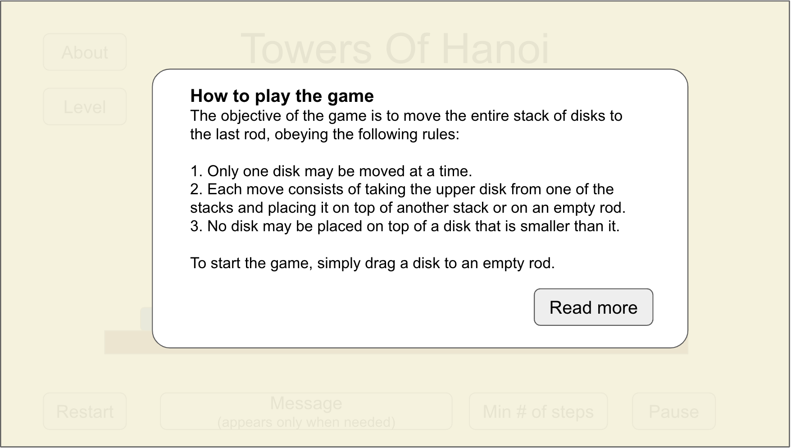

## Project Description 

The Tower of Hanoi is a mathematical game or puzzle consisting of three rods and a number of disks of various diameters, which can slide onto any rod. The puzzle begins with the disks stacked on one rod in order of decreasing size, the smallest at the top. The objective of the puzzle is to move the entire stack to the last rod, obeying the following rules:

1. Only one disk may be moved at a time.
2. Each move consists of taking the upper disk from one of the stacks and placing it on top of another stack or on an empty rod.
3. No disk may be placed on top of a disk that is smaller than it.

>** From Wikipedia: https://en.wikipedia.org/wiki/Tower_of_Hanoi

Apart from moving the stack to the last rod, the goal is to do it with minimum number of steps and minimum time.

## Wire Frames

## User Stories
### MVP Goals

- As a player, I want to see a graphical representation of the game so I can see where the disks are.
- As a player, I want be able to move a disk from one tower to another so I can finish the puzzle.
- As a player, I want to see the number of moves I have played so I can know if I did it with the minimum number of steps.
- As a player, I want to know what is the minimun number of steps for the current level.
- As a player, I want to see the time elapsed since I started the game.
- As a player, I want to be able to pause the game so I can continue later.
- As a player, I want to be able to access the game rules easily so I can know how to play.
- As a player, I want to be able to go to the next level or repeat the current level when I finish a game.
- As a player, I want to be able to stop the game and restart so I can start from the beginning if I made a mistake.
- As a player, I want to get a notification when I try to make a forbidden move so I can learn the rules.
- As a player, I want to get a confirmation that I finished the game successfuly.

### Stretch Goals
- As a player, I want to get a "treat" when I complete a game successfuly.
- As a player, I want to have a "guided mode" that help me solve the puzzle with minimun number of steps.
- As a player, I want see records of past games.
- As a player, I want to be able to run a "show me" game solution so I can learn how to solve the puzzle.

## Wireframes

### Main view

### About the game

